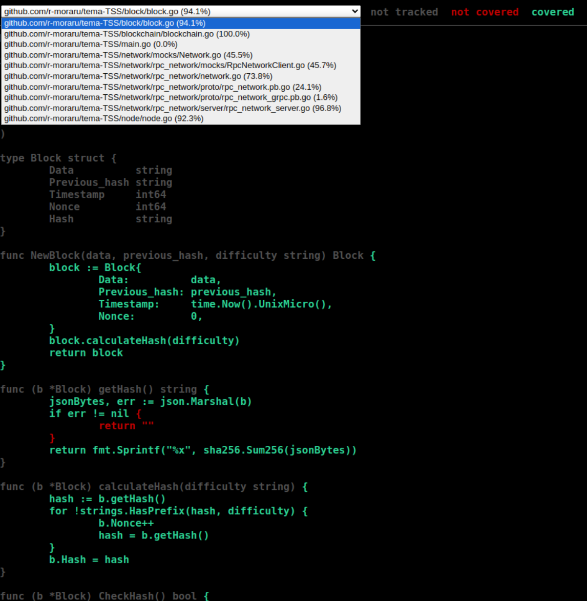
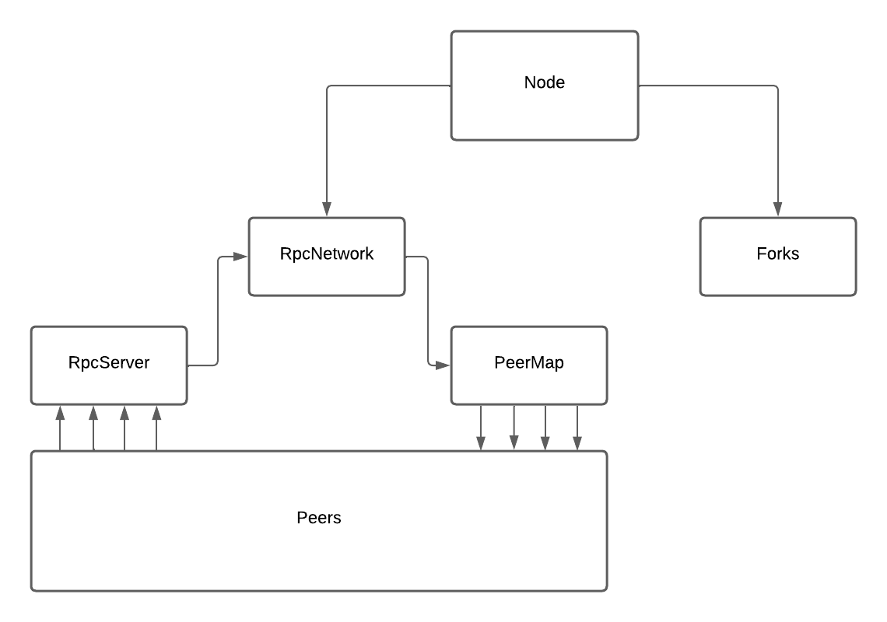

## Rularea testelor + coverage

- Pentru rularea tuturor testelor + coverage: din root-ul proiectului: `go test ./... -coverprofile=c.out`
- Afisarea in browser a reportului de coverage: `go tool cover -html=c.out` (obs: fisierele autogenerate sunt cele cu coverage scazut)

## Arhitectura proiectului

### Node

- Nodul, definit in `node/node.go`, comunica cu reteaua prin interfata `Network`, mentine intern fork-uri ale blockchain-ului si creaza blocuri noi.
- La initializare (prin constructorul `NewNode`), nodul cere cel mai lung blockchain de la retea si il adauga in forks.
- La rulare, nodul executa un event loop, in care ori proceseaza informatii noi de la retea, ori construieste un bloc nou si il trimite catre retea.
- Construirea unui bloc nou este facuta dupa cel mai lung "fork" cunoscut.

### Block

- `Block` defineste structura blocurilor, crearea (inclusiv minarea hash-ului) unui bloc nou, si validarea acestora.

### Blockchain

- `Blockchain` defineste structura unui blockchain, adaugarea blocurilor noi (cu validare), metode de tip getter (`GetBlockchainLength` si `GetLastBlock`), si utilitare.

### Network

- Reteaua este definita ca o interfata. Acest lucru permite utilizarea mai multor implementari, in functie de nevoi, cat si crearea de mocks pentru testare.
- Interfata retelei permite: 
    - Cererea unui blockchain nou (`SendBlockchainRequest`)
    - Citirea unui blockchain de la retea, daca a fost primit (`GetBlockchain`)
    - Verificarea daca a fost trimisa o cerere de blockchain catre nod (`BlockchainRequest`)
    - Citirea unui block de la retea, daca a fost primit (`GetBlock`)
    - Trimiterea unui block catre retea (`SendBlock`)
    - Trimiterea unui blockchain catre retea (`SendBlockchain`)
    - Citirea request-urilor de adaugare de date in blockchain de la retea (`GetData`)

### Implementarea retelei: RPC network

#### RPC server

- Implementeaza serviciul definit in `network/rpc_network/rpc_network.proto`
- Defineste `RunRpcServer` ca functie utilitara de pornire a server-ului pe un anumit port. Functia returneaza un pointer catre server, o functie de callback pentru oprirea acestuia, si o eroare daca rularea nu a avut succes.

#### RPC network

- `RpcNetwork`, definit in `network/rpc_network/rpc_network.go`, implementeaza interfata de retea si defineste metode utilitare pentru pornirea retelei (`NewRpcNetwork`, `BuildPeerMap`).
- In retea, nodurile au Id pentru a putea fi identificate. Id-urile si clientii RPC pentru peers sunt gasite in `peerMap`.
- Request-urile sunt primite prin `RpcServer` si trimise prin clientii din `peerMap`.
- O observatie importanta este ca reteaua momentan este fixa, neexistand un mod de adaugare de peers noi.

## Teste unitare

- Teste unitare au fost scrise pentru clasele de baza (`Block`, `Blockchain`, `RpcServer`).
- Testele pentru `Block` (`block/block_test.go`) testeaza initializarea, minarea si validarea blocurilor.
- Testele pentru `Blockchain` (`blockchain/blockchain_test.go`) testeaza adaugarea de blocuri noi in diferite circumstante (blocuri valide/invalide), si utilitarele (`GetBlockchainLength`, `GetLastBlock`, `Copy`).
- Testele pentru `RpcServer` testeaza initializarea serverului, si implementarea metodelor (primirea de date valide/invalide).

## Teste de integrare

- `Node` si `RpcNetwork` cuprind mai multe componente.
- Testele pentru `Node` creeaza date simulate (mock data) in retea si verifica comunicarea cu aceasta, crearea blocurilor si trimiterea lor, si management-ul de fork-uri.
- Testele pentru `RpcNetwork` creeaza date simulate (mock data) pentru clientii RPC ca peers si testeaza comunicarea cu ei, integrarea cu `RpcServer`, si initializarea retelei.

## Teste generate cu AI

- Testele au fost generate cu ChatGPT.
- Testele au fost scrise pentru clasele (`Block`, `Blockchain`, `RpcServer` si `Node`).
- Testele generate cu AI testeaza initiliazarea claselor, validitatea claselor create si implementarea metodelor.
- O parte din teste nu compileaza si nu inteleg contextul aplicatiei.
- De exemplu, 'TestCopyBlockchain' incearca sa verifice daca adaugarea unui bloc in copiia unui blockchain nu afecteaza varianta originala, insa testul adauga un block invalid la copie. Astfel blockchain-urile raman identice, iar assertion-ul pentru egalitate va pica.
- Testele au un coverage limitat.
- Testul pentru nod apeleaza metoda Run a nodului fara a avea un sistem de cancel, testul ruland la infinit.

## Referinte

[1] Nakamoto, Satoshi, "Bitcoin: A Peer-to-Peer Electronic Cash System", https://bitcoin.org/bitcoin.pdf, Data ultimei accesari: 18.04.2024
[2] Mockery docs, https://docs.mockery.io/en/latest/, Data ultimei accesari: 11.05.2024
[3] gRPC docs, https://grpc.io/docs/, Data ultimei accesari: 11.05.2024
